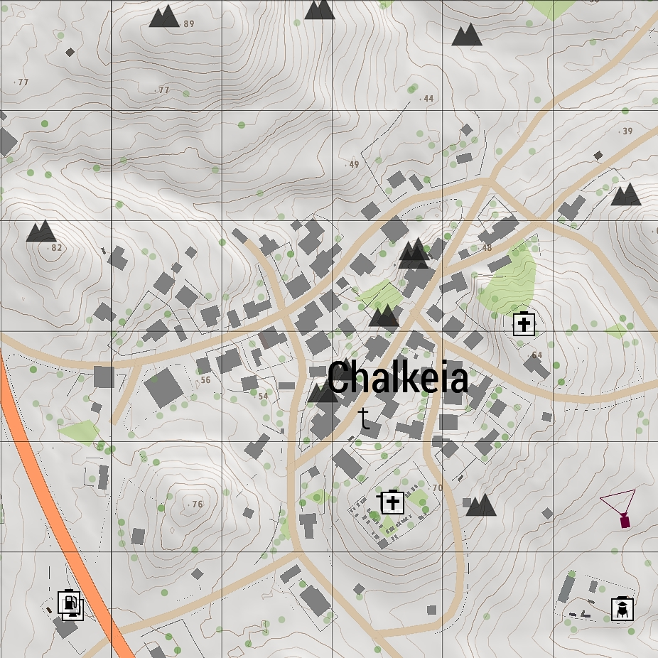
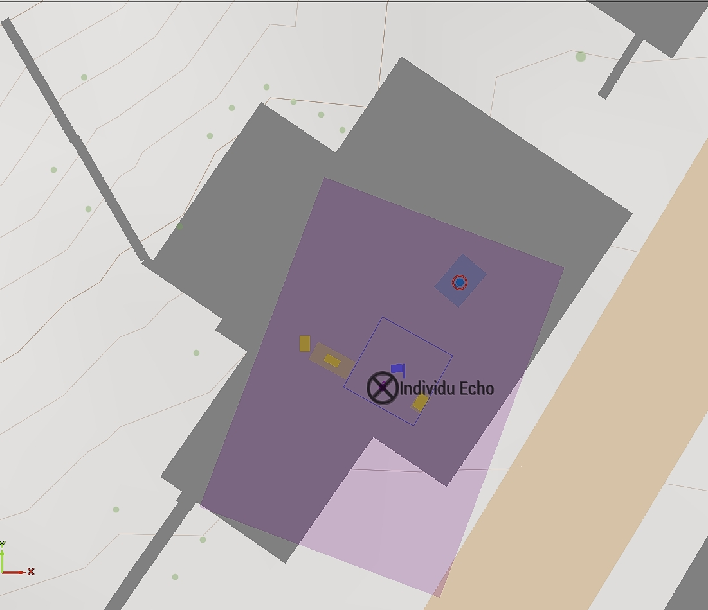
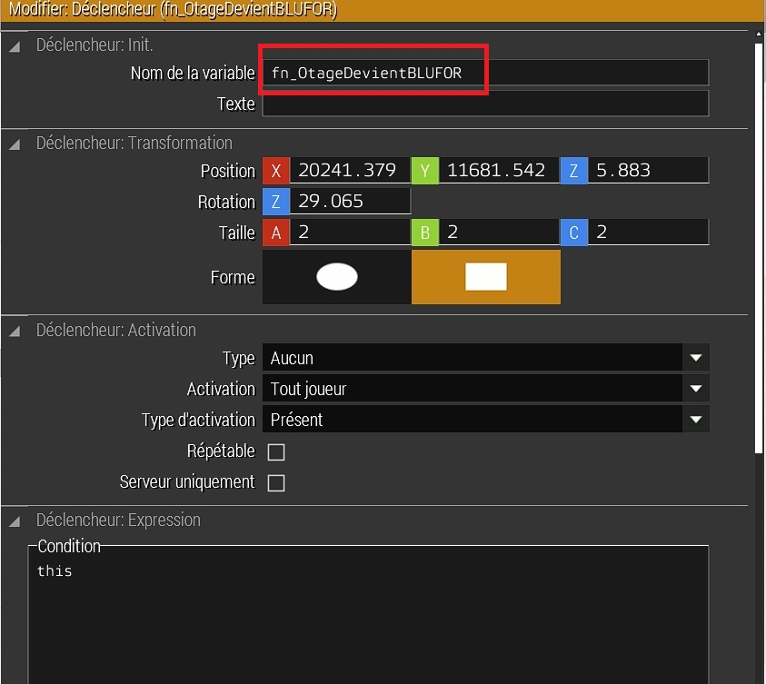
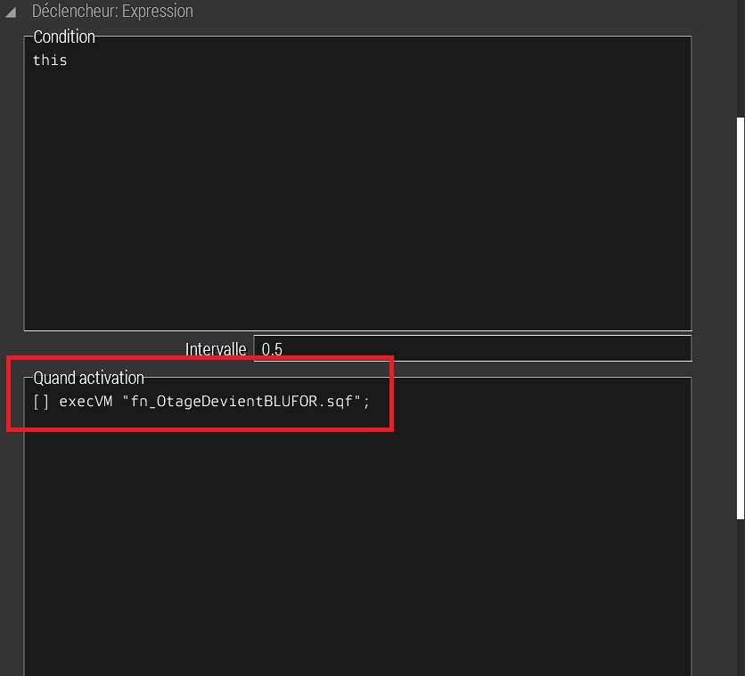
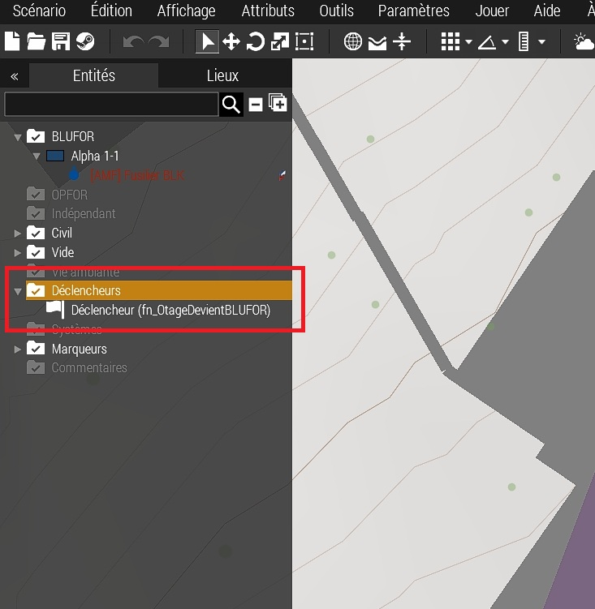
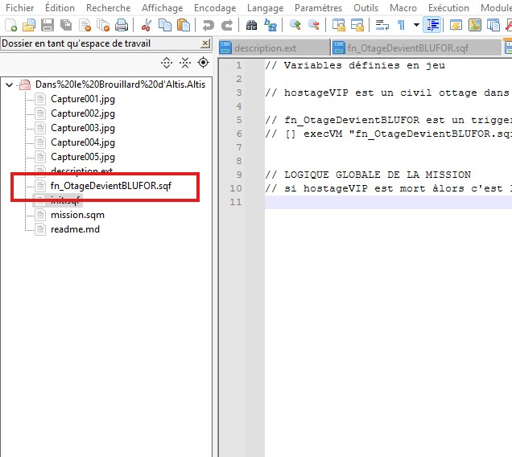

# Dans le brouillard d'Altis

## Choix de l'emplacement de la mission

Le village de Chalkeia (Altis)

### Pourquoi ce lieu ?

|  |
| :---------------------------: |

- Il est situé dans une zone montagneuse, ce qui permet de profiter du relief pour contourner les unités ennemies.
- Aux alentours, il y a des zones de plateaux pour faire atterrir un hélicoptère.
- La végétation est assez dense, ce qui permet de se cacher.

## Par quoi commencer ?

- Avant de commencer, il faut définir et coder la logique de jeu.
- Choisir un otage
- Définir sa place dans la mission
- Mettre un trigger (déclencheur pour activer une fonction) autour de l'otage pour définir son statut.

|  |
| :---------------------------: |

|  |
| :---------------------------------: |

## Dans le dossier de la mission (paramétrage pour toutes les missions)

- Ouvrir les fichiers de la mission (Documents/Arma 3/dossier de votre profil/missions/nom_de_la_mission) dans un éditeur de code (VSCode, Notepad++, Cursor, etc.).
- Créer un fichier init.sqf pour la fonction de base du jeu.
- Créer un fichier description.ext pour la description de la mission, la gestion du son, les paramètres de la mission, etc.
- Définir dans le fichier init en commentaire tout ce que vous avez défini dans l'éditeur Arma 3.

Voir le code du fichier [init.sqf](../init.sqf)

## Comment coder une fonction (fonction de conversion de l'otage en soldat BLUFOR)

- Créer un fichier fn_OtageDevientBLUFOR.sqf pour la fonction de conversion de l'otage en soldat BLUFOR.
- Dans l'éditeur Arma 3, nommer le déclencheur (nom de variable) avec le même nom que la fonction.
- Dans la section "Quand activation" du déclencheur, mettre l'appel de la fonction "[] execVM "fn_OtageDevientBLUFOR.sqf";"
- Tout cela permet de mieux se repérer dans le code, dans l'éditeur Arma 3 et les objets présents dans la mission.

### Dans le déclencheur

|  |
| :---------------------------: |

_NOTE_ : Le déclencheur doit s'activer si un joueur est présent dans la zone.

### Dans l'onglet "Quand activation" du déclencheur

|  |
| :---------------------------: |

### Dans la liste des objets de la mission

|  |
| :---------------------------: |

### Dans l'éditeur de code de votre mission

|  |
| :---------------------------: |

## Code de la fonction "fn_OtageDevientBLUFOR.sqf" avec les commentaires

La fonction est codée en sqf, c'est un langage de script pour Arma 3.
Elle est composée de plusieurs parties :

- Vérifier si l'otage existe
- Sauvegarder les informations de l'otage
- Sauvegarder les vêtements et équipements de l'otage
- Sauvegarder l'inventaire de l'otage
  - Toutes ses sauvegardes sont faites dans des variables privées pour ne pas interférer avec le jeu.
  - Toutes les variables sont préfixées par un underscore "\_" pour les différencier des variables du jeu.
  - Toutes les variables sont définies pour que le BLUFOR soit le même que le civil .
- Supprimer l'otage
  - On supprime le civil car il aura du mal à suivre et ne sera pas poursuivi par les ennemies.
- Créer un nouveau soldat BLUFOR
  - On crée un nouveau soldat BLUFOR avec les mêmes informations que le civil.
- Restaurer la position et direction de l'otage
  - On restaure la position et la direction de l'otage avec un peut plus de hauteur pour ne pas qu'il se retrouve dans le sol ou à l'étage en dessous.
- Restaurer l'identité de l'otage
- Vider l'inventaire de l'otage
- Restaurer les vêtements de l'otage
- Rejoindre le groupe du joueur
- Sortir de l'animation actuelle
- Restaurer l'inventaire de l'otage
- Améliorer les compétences du nouveau soldat
- Définir le moral et le comportement du nouveau soldat
- Message de confirmation (facultatif peut servir uniquement lors du développement)

Voir le code du fichier [fn_OtageDevientBLUFOR](../fn_OtageDevientBLUFOR.sqf)

_NOTE_ : Le message de confirmation est affiché pour vérifier que la fonction a été appelée correctement. On peut le supprimer si on le souhaite.

## Fin de la section

Avec cette fonction, nous avons déja défini la logique pour la mission principale.
