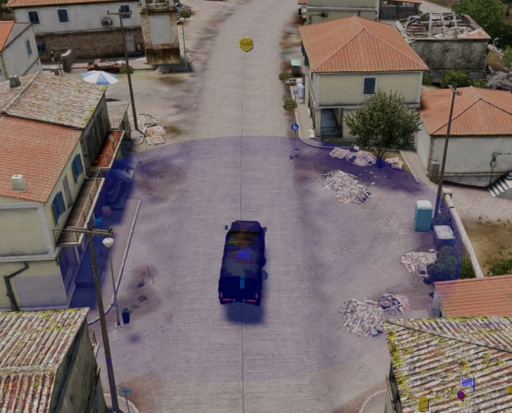
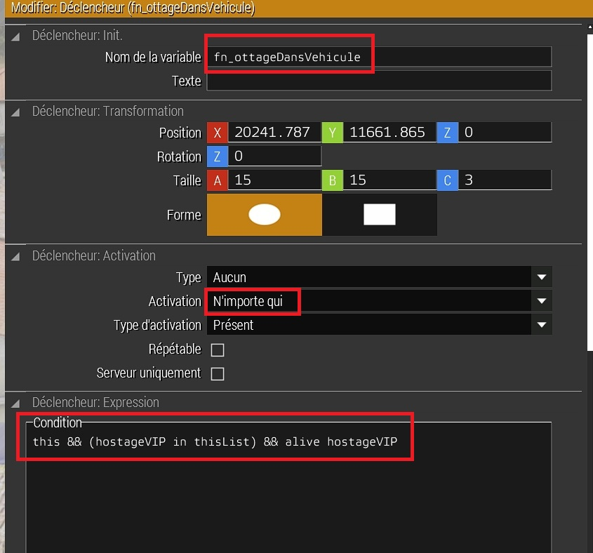
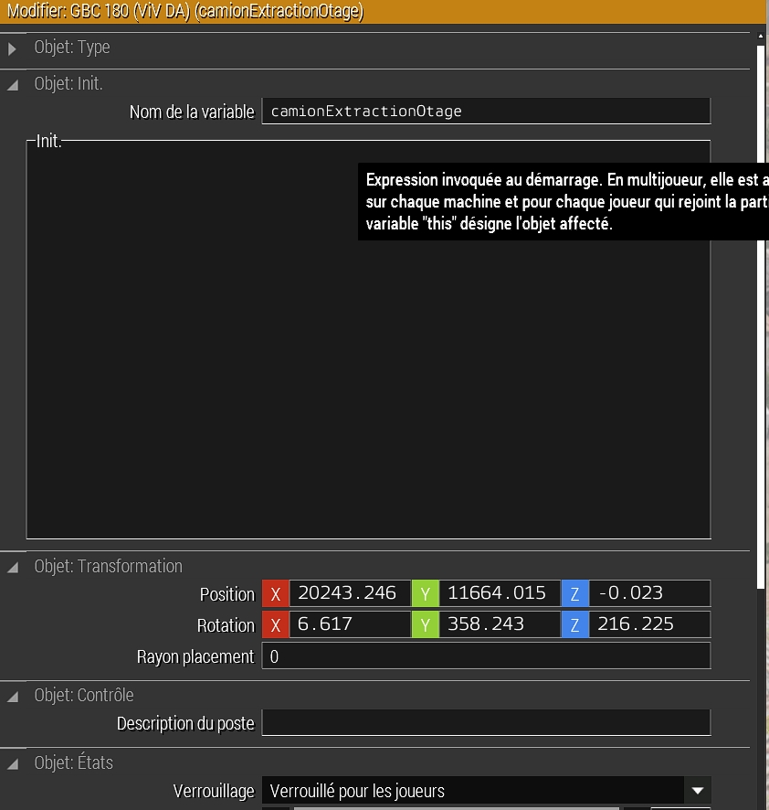
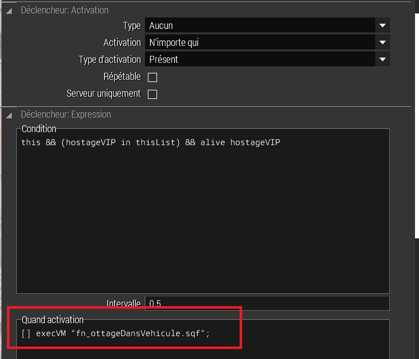

# Dans le brouillard d'Altis

## Mise en place de la situation

|  |
| :---------------------------: |

Placer sur la carte (proche du joueur) un camion d'extraction avec son conducteur, un déclancheur, un objet vide (j'ai placé une pierre) pour définir la direction du camion. Nommer les variables comme suit :

|  |
| :---------------------------: |

La condition : "this && (hostageVIP in thisList) && alive hostageVIP" permet de vérifier que l'otage est présent dans le déclancheur et que l'otage est vivant. Cette condition est nécessaire pour éviter que le camion d'extraction parte sans l'otage.

Le camion est verrouillé pour les joueurs afin d'éviter que d'autres unités y accèdent.

|  |
| :---------------------------: |

- Le nom de la variable du conducteur du camion d'extraction est "ConducteurCamionExtractionOtage".
- Une petite pierre est nommée "directionCamionExtraction" elle permet de définir la direction du camion d'extraction.
- Dans l'onglet "Quand activation" du déclencheur, mettre l'appel de la fonction "[] execVM "fn_ottageDansVehicule.sqf";"

Voir le code du fichier [fn_ottageDansVehicule](../fn_ottageDansVehicule.sqf)

_NOTE_ : Pendant la phase de développement, on place tous les élements à proximité pour vérifier que tout fonctionne correctement. Ensuite, on pourra les déplacer pour les mettre dans des endroits plus éloignés.

|  |
| :---------------------------: |

## Fin de la section

Avec cette fonction, nous avons défini le second objectif de la mission.
