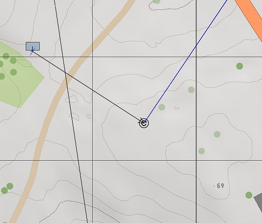
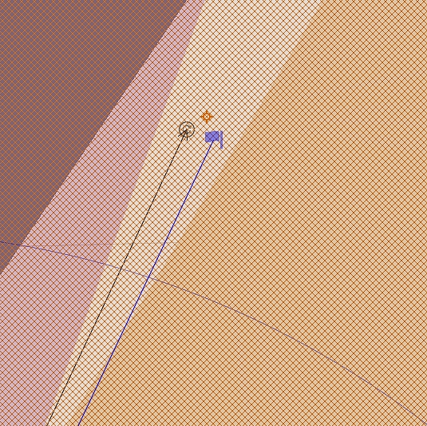
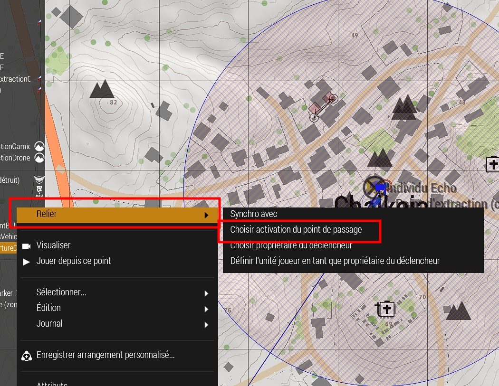
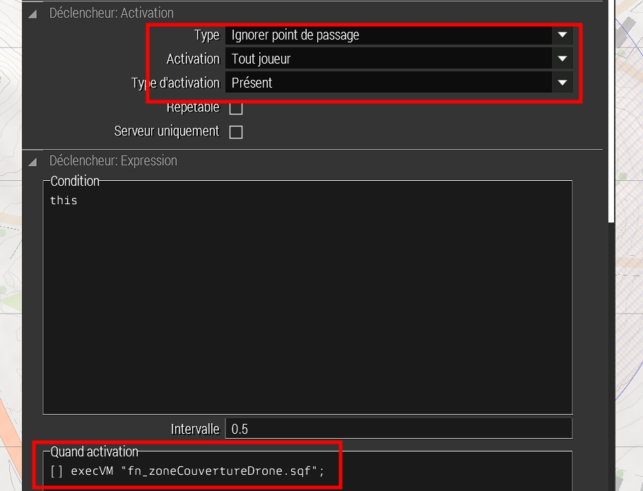

# Dans le brouillard d'Altis

## Mise en place du drone

- Dans la carte ajouter les éléments suivants :
  - Un drone
  - Un objet vide qui permet de définir la direction du drone à la fin de la mission
  - Un trigger qui permet de déclancher la zone de couverture du drone
  - Un marker qui permet d'afficher en jeu la zone de couverture du drone
  - Deux Waypoints (vol en attente) pour le drone
  - Deux ennemies pour les tests

## L'objectif du drone

Le drone est positionné à une place stratégique (premier vol en attente), quand le joueur pénetre dans la zone de couverture du drone, le drone change de position et commence à surveiller la zone (deuxième vol en attente). Apres quelques secondes, le drone donne régulièrement des informations sur la zone de couverture avec les positions ennemies. Une fois que la zone est sécurisée (qu'il n'y a plus d'ennemies dans la zone), le drone se dirige vers l'objet vide et disparaît au loin (suppression du drone).

## Parametrage des éléments dans l'éditeur

### Le drone nommé "droneBLUFOR" le premier waypoint

On positionne le drone loin de la zone de couverture du drone. On décoche la case "Activer les dégats". et on lui assigne un premier waypoint (volEnAttente).

|  |
| :---------------------------: |

|  |
| :---------------------------------: |

### Le marqueur, le déclencheur et le deuxième waypoint

On positionne un marqueur "zoneCouvertureDrone", un déclencheur "fn_zoneCouvertureDrone" et le deuxieme waypoint, exactement au meme endroit. (pas comme sur la capture)

|  |

Le marqueur est un cercle de 220m de rayon, il permet au joueur de voir la zone de couverture du drone en jeu. j'ai choisi de le mettre en couleur orange avec un alpha de 0.7 en utilisant la grille diagonale.

Le déclencheur est un trigger de 220m de rayon qui permet de déclancher la zone de couverture du drone. Il est réglé pour déclancher la zone de couverture et annuler le premier waypoint.

Le waypoint "vol en attente" est défini avec un rayon de 120 pour etre dans le rayon du marqueur avec une hauteur de 3m. pour qu'il soit vu par le joueur (plus immersif)

Faites un clic droit sur le déclencheur et sélectionner "Choisir activation du point de passage" et relier le trait bleu au premier waypoint.

|  |
| :---------------------------: |

Puis sélectionner le déclencheur, aller dans l'onglet "Quand activation" et mettre l'appel de la fonction "[] execVM "fn_zoneCouvertureDrone.sqf";"

Ne pas oublier de déclancher le déclencheur lors de la présence du joueur et de le déterminer de type "Ignorer le point de passage".

|  |
| :---------------------------: |

positionner des ennemies dans la zone de couverture du drone pour tester la fonctionnalité.

le code de la fonction est dans le fichier [fn_zoneCouvertureDrone](../fn_zoneCouvertureDrone.sqf) :
