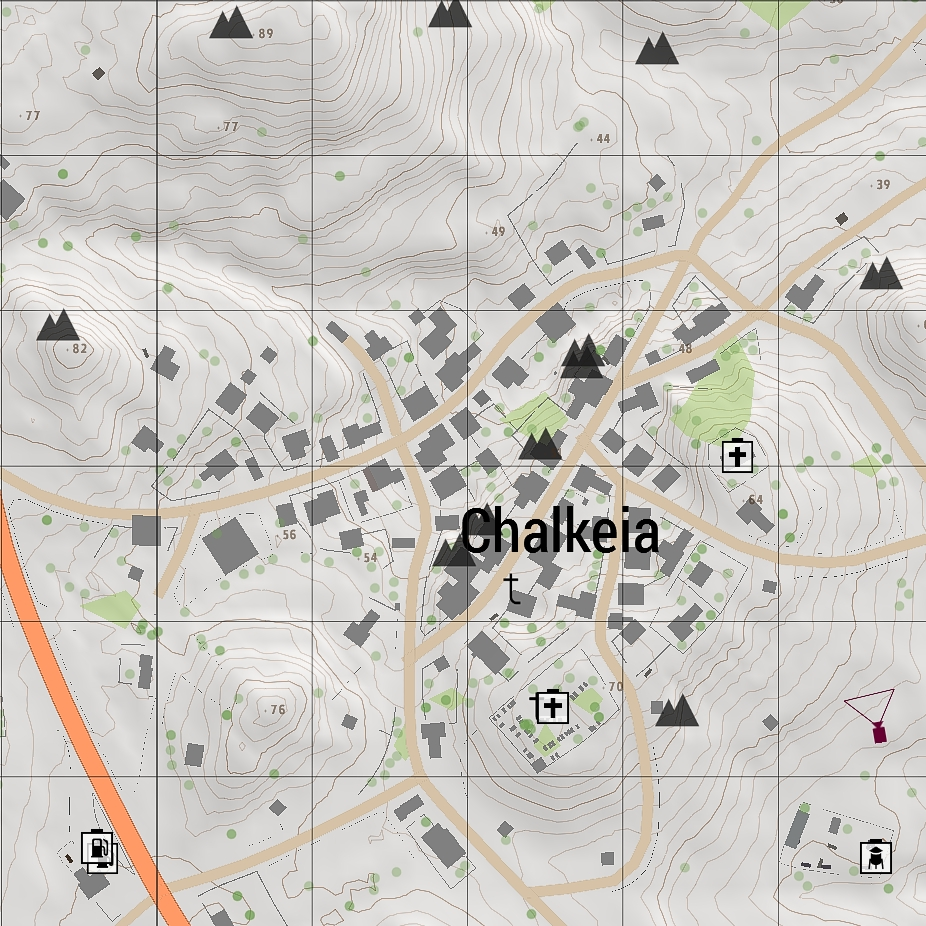
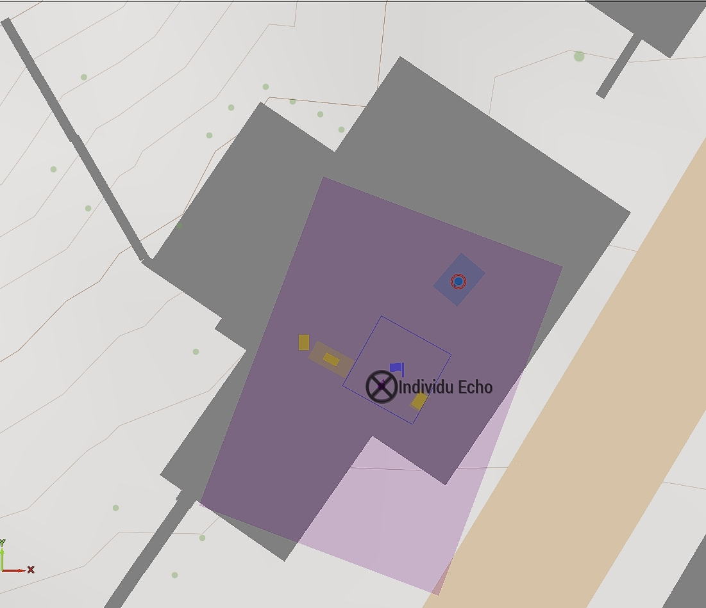
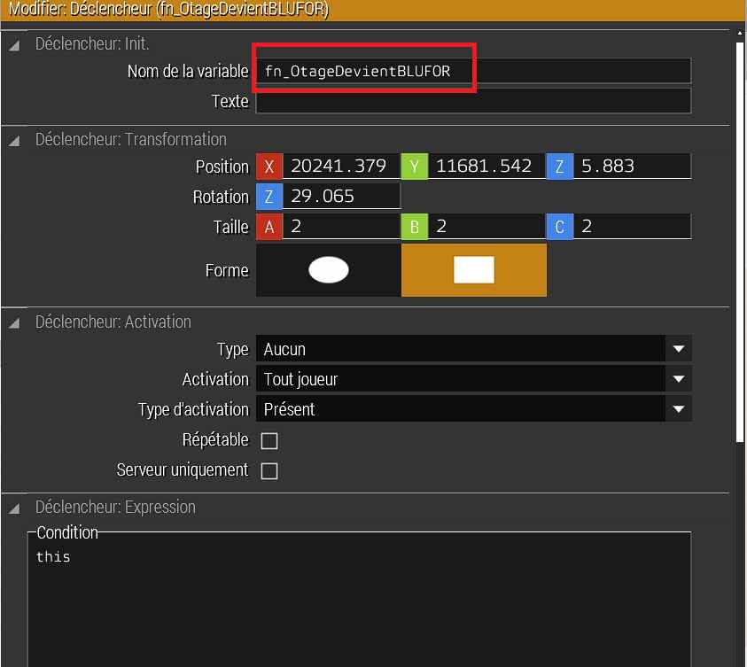

# Dans le brouillard d'Altis

## Choix de l'emplacement de la mission

### Pourquoi ce lieu ?

- Il est situé dans une zone montagneuse, ce qui permet de profiter du relief pour contorner les unités ennemies.
- Au alentour, il y a des zones de plateaux pour faire attérir un hélicoptère.
- La végétation est assez dense, ce qui permet de se cacher.

## Par quoi commencer ?

- Avant de commencer, il faut définir et coder la logique de jeu.
- Choisir un hotage :

- Définit sa place dans la mission :

- Maison accessible par deux entrées
- Au milieu du village
- Maison a deux étages
