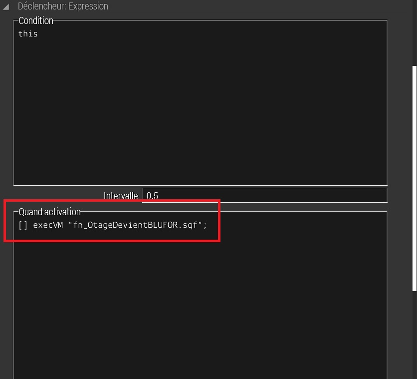
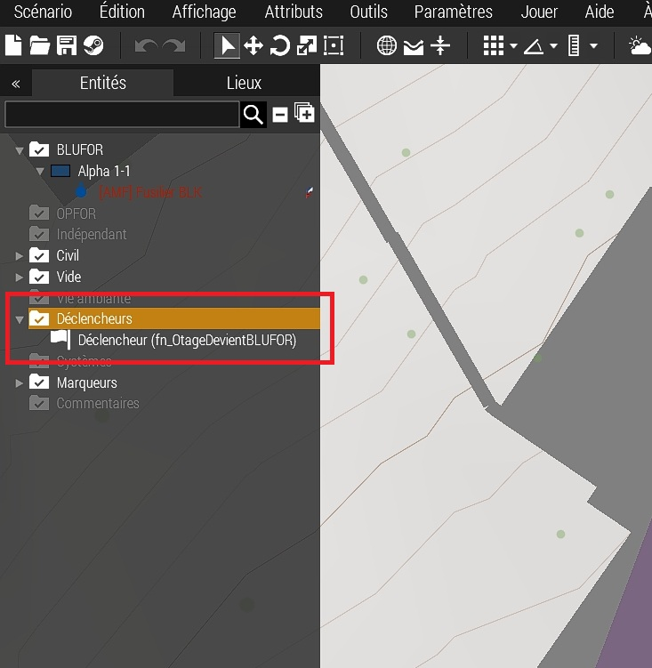
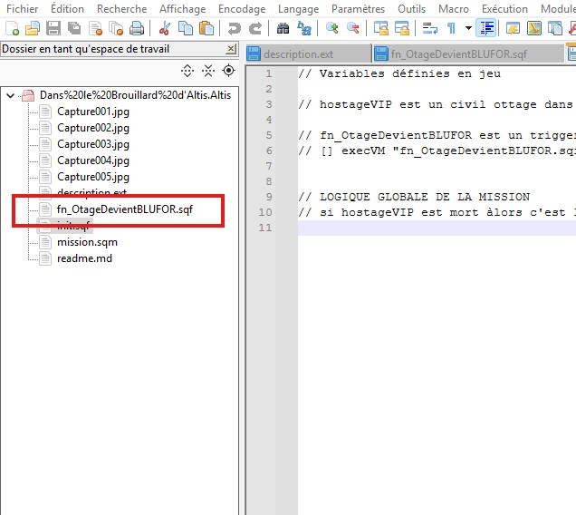

# Dans le brouillard d'Altis

## Choix de l'emplacement de la mission

Le village de Chalkeia (Altis)

### Pourquoi ce lieu ?

  

- Il est situé dans une zone montagneuse, ce qui permet de profiter du relief pour contorner les unités ennemies.
- Au alentour, il y a des zones de plateaux pour faire attérir un hélicoptère.
- La végétation est assez dense, ce qui permet de se cacher.

## Par quoi commencer ?

- Avant de commencer, il faut définir et coder la logique de jeu.
- Choisir un hotage
- Définit sa place dans la mission
- mettre un trigger (déclancheur pour activé une fonction) autour de l'hotage pour définir son statut.

  

## Début du code (paramettrage pour toutes les missions)

- ouvrir les fichiers de la mission (documents/ Arma3/dossier de votre profil/missions/nom_de_la_mission) dans un éditeur de code. (VSCode, Notepad++, Cursor, etc.)
- Créer un fichier init.sqf pour la fonction de base du jeu.
- Créer un fichier description.ext pour la description de la mission, la gestion du son, les paramètres de la mission, etc.
- Définir dans le dossier init en commentaire tout ce que vous avez défini dans l'éditeur Arma 3.

## Début du code (fonction de conversion de l'hotage en soldat BLUFOR)

- Créer un fichier fn_OtageDevientBLUFOR.sqf pour la fonction de conversion de l'hotage en soldat BLUFOR.
- Dans l'éditeur Arma 3, nommer le déclancheur (nom de variable) avec le meme nom que la fonction.
- Dans la section "Quand activation" du déclancheur, mettre l'appel de la fonction "[] execVM "fn_OtageDevientBLUFOR.sqf";"
- Tout cela permet de mieux se repérer dans le code, dans l'éditeur Arma 3 et les objets présents dans la mission.

### Dans le déclancheur

  

### Qaund activation

  

### Dans la liste des objets de la mission

  

### Dans le code de votre mission

  

